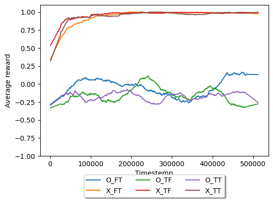
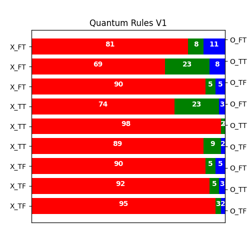
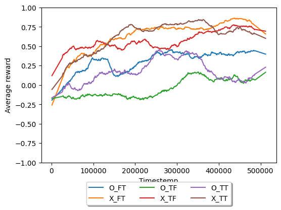
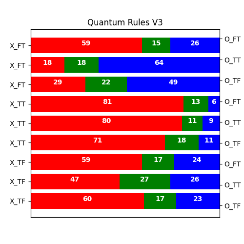

# Reinforcement Learning for Quantum Tic-Tac-Toe

This repository contains the code and documentation for exploring reinforcement learning (RL) techniques applied to Quantum Tic-Tac-Toe. The project aims to integrate quantum computing concepts with RL algorithms to create an innovative approach to the classic game of Tic-Tac-Toe.

## Introduction

Quantum Tic-Tac-Toe \cite{goff2006quantum} is an extended version of the classic Tic-Tac-Toe game that incorporates quantum mechanics, such as superposition and entanglement, into the gameplay. This project explores the application of reinforcement learning methods to Quantum Tic-Tac-Toe, providing insights into how RL can be leveraged in quantum environments.

Despite the availability of Quantum Chess \cite{youvan2024sequential,cantwell2019quantum}, which is more complex, Quantum Tic-Tac-Toe serves as a more accessible testbed for combining quantum computing and RL. Our approach includes the following:

- **Two Versions of the Game**: Each with different rules regarding entanglement moves.
- **Reinforcement Learning Agents**: Implementing and comparing different RL strategies.
- **Analysis**: Evaluating the performance of agents under various game rules.

## Methodology

### Game Versions

We investigate two distinct versions of Quantum Tic-Tac-Toe:

1. **Version 1 (V1)**: Entanglement moves are restricted to pairs containing at least one empty cell.
2. **Version 3 (V3)**: Any pair of cells can be used for entanglement moves.

For a detailed explanation of the game's rules and state representations, refer to the [Appendix](#appendix).

### Representation of the State

Quantum Tic-Tac-Toe features challenges such as partial observability and exponential state complexity. We use two methods to represent the game state:

- **Measurements**: A 3x3 matrix of state probabilities.
- **Move History**: A 9x9 matrix tracking historical entanglement relations.

### Reinforcement Learning

We use Proximal Policy Optimization (PPO) \cite{schulman2017proximal,tang2020implementing,liu2021self} to train agents in Quantum Tic-Tac-Toe. Agents are compared based on their performance with different types of information (measurement matrices, historical entanglement records).

## Results

### Version 1 (V1)

The first set of results shows that the first player tends to have an advantage due to the constraints on entanglement moves. This suggests that certain strategies may be more effective, even within the randomness of the quantum environment.


*Average reward on 100 games during the training of different agents.*


*Pitting best agents: X-Wins, O-Wins, Draws.*

### Version 3 (V3)

In Version 3, where entanglement constraints are removed, combining measurement matrices with historical entanglement records leads to better performance and more balanced outcomes.


*Average reward on 100 games during the training of different agents.*


*Pitting best agents: X-Wins, O-Wins, Draws.*

## Discussion

Quantum Tic-Tac-Toe offers a valuable testbed for RL in quantum settings. The results highlight the importance of comprehensive information (both measurements and historical records) for effective decision-making. Future work could explore more advanced RL techniques and methods to better address partial observability, such as using recurrent neural networks or transformers.

## Installation

To get started with this project, follow these steps:

1. **Clone the Repository**

   ```bash
   git clone https://github.com/Dinu23/Quantum-Tiq-Taq-Toe.git
   cd Quantum-Tiq-Tac-Toe
   ```

2. **Install Unitary**

   Unitary is not available as a PyPI package. You need to clone the repository and install it from source:

   ```bash
   git clone https://github.com/unitaryfund/unitary.git
   cd unitary
   pip install .
   ```

3. **Install Other Dependencies**

   Make sure you have the necessary Python packages installed:

   ```bash
   pip install -r requirements.txt
   ```

4. **Run the Code**

   You can use the following scripts to train and play the Quantum Tic-Tac-Toe game:

   - **Train the RL Agent**: 

     ```bash
     python train.py --rules <V1|V3> --measuremnt <True|False> --moves <True|False> --network <32,32,16> -N <100> -t <10000> -s <1024> -lr <0.01> --linear <True|False> -m <1> -f <models> -l <logs> -v <1> -d <cpu|cuda>
     ```

     Here’s a description of each argument:

     - `--rules`: The version of the game rules to use (default: "V1").
     - `--measuremnt`: Whether to use measurement information (default: True).
     - `--moves`: Whether to use move history information (default: True).
     - `--network`: List of integers defining the network architecture (default: [32,32,16]).
     - `-N` / `--N`: Number of enemy changes (default: 100).
     - `-t` / `--timestemps`: Number of timesteps to train the model (default: 10000).
     - `-s` / `--no_steps`: Number of steps per training session (default: 1024).
     - `-lr` / `--lr`: Learning rate (default: 0.01).
     - `--linear`: Whether to use a linear learning rate (default: True).
     - `-m` / `--modifier`: Modifier for training the O player more (default: 1).
     - `-f` / `--folder`: Folder to save models (default: "models").
     - `-l` / `--logs`: File for logs (default: 'logs').
     - `-v` / `--verbose`: Verbosity level (default: 1).
     - `-d` / `--device`: Device to use for training ('cpu' or 'cuda', default: 'cpu').

   - **Play the Game**:

     ```bash
     python play.py -V <1|3> -X <human|random|model> -O <human|random|model> -pathX <path_to_X_agent> -pathO <path_to_O_agent> --measurmentX <True|False> --movesX <True|False> --measurmentO <True|False> --movesO <True|False>
     ```

     Here’s a description of each argument:

     - `-V`: The version of the game rules to use (1 or 3, default: 3).
     - `-X`: Type of agent for player X (options: "human", "random", "model", default: "random").
     - `-O`: Type of agent for player O (options: "human", "random", "model", default: "random").
     - `-pathX`: Path to the model for player X (required if X is "model").
     - `-pathO`: Path to the model for player O (required if O is "model").
     - `--measurmentX`: Whether to use measurement information for player X (default: True).
     - `--movesX`: Whether to use move history information for player X (default: True).
     - `--measurmentO`: Whether to use measurement information for player O (default: True).
     - `--movesO`: Whether to use move history information for player O (default: True).

## Contributing

We welcome contributions from the community! To contribute:

1. **Fork the Repository**

2. **Create a Feature Branch**

   ```bash
   git checkout -b feature/YourFeatureName
   ```

3. **Commit Your Changes**

   ```bash
   git commit -am 'Add new feature'
   ```

4. **Push to the Branch**

   ```bash
   git push origin feature/YourFeatureName
   ```

## Contact

For questions or feedback, please contact:

- **Catalin Dinu**: [viorel.dinu00@gmail.com](viorel.dinu00@gmail.com)

## Appendix

### A. Environment

Quantum Tic-Tac-Toe is played on a 3x3 board where each cell can be in a superposition of three states: empty, X, or O. The state of the game is represented as a linear combination of all possible classical states.

**Action Space**: Moves include standard X/O placements and quantum entanglements between pairs of cells.

**State Collapsing**: This occurs when the game board is fully populated, collapsing the quantum state to one of the possible classical states.

### B. Observation Space

**Measurements**: Estimated probabilities of each cell being in a specific state based on simulations.

**Move History**: Matrix tracking historical entanglement relations.
